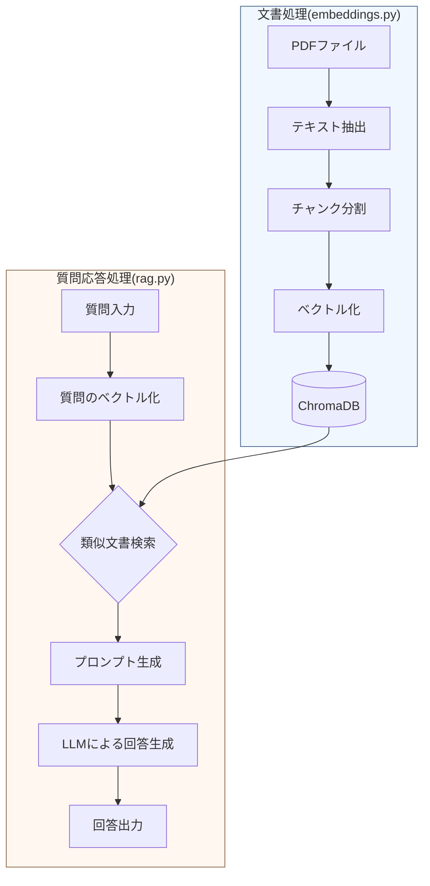

# RAG サンプルコード

PDF文書を用いたRAG（Retrieval-Augmented Generation）のサンプル実装です。文書をベクトル化して保存し、質問に対して関連する情報を検索・参照しながら回答を生成します。

## 目次

- [機能概要](#機能概要)
- [環境構築](#環境構築)
- [使用方法](#使用方法)
- [処理](#処理)

## 機能概要

本サンプルコードでは以下の機能を提供します：

1. PDF文書の読み込みと分割処理
2. 文書チャンクのベクトル化と保存
3. 質問に関連する文書の検索
4. LLMを用いた回答生成

## 環境構築

> **Note**
> 以下の手順はWindows環境向けです。他のOS（MacやLinux）をお使いの場合は、それぞれの環境に合わせたインストール手順をご参照ください。

### 1. Pythonのインストール

1. [Python公式サイト](https://www.python.org/downloads/windows/)から Python 3.11.9 をダウンロード
2. インストーラーを実行
   - "Add python.exe to PATH"にチェックを入れる
3. コマンドプロンプトでインストールを確認
```bash
python --version
```

### 2. 依存パッケージのインストール

コマンドプロンプトで以下を実行：
```bash
py -3.11 -m pip install -r requirements.txt
```

必要なパッケージ：

- langchain-community
- langchain-chroma
- langchain-ollama
- chromadb (v0.5.3)
- chroma-hnswlib (v0.7.3)
- pypdf

### 3. Ollamaのインストール

1. [Ollama公式サイト](https://ollama.com/download/windows)からインストーラーをダウンロード
2. インストーラーを実行
3. コマンドプロンプトで以下のコマンドを実行し、必要なモデルをインストール：
```bash
# 埋め込みモデル
ollama pull kun432/cl-nagoya-ruri-large

# 生成モデル
ollama run schroneko/gemma-2-2b-jpn-it
```

## 使用方法

### 1. 文書の埋め込み処理

```bash
python embeddings.py
```

処理結果：
- チャンク分割されたテキストが`*_chunks.txt`ファイルに出力
- ベクトルデータが`chroma_db`ディレクトリに保存

### 2. 質問応答の実行

```bash
python rag.py
```

- プロンプトに従って質問を入力
- `quit`と入力で終了

実行例：
```
質問: 冬の服装は？

=== 検索結果（Similarity Search）===

[文書 1] 類似度スコア: 0.7325
内容: 1 / 2
○○ ⾼等学校学則（抜粋）
第 1 章  服装規定
⽣徒 は 指定 された 制服 を 正 しく 着⽤ しなければならない。 制服 の 改造 は ⼀切認 めない。スカート 丈 は 膝下 とし、ズボンの 裾 を 絞 ること
を 禁⽌ する。 防寒着 として 着⽤ できるのは、 紺⾊ または 黒⾊ のカーディガンのみとする。 制服 への 装飾品 の 付加 は 禁⽌ する。
--------------------------------------------------------------------------------

[文書 2] 類似度スコア: 0.7071
内容: 髪 が 肩 より ⻑ い 場合 は、 必 ず 束 ねること。
第 3 章  携帯電話規定
携帯電話 の 校内使⽤ は 原則 として 禁⽌ する。 登校時 に 職員室 で 預 かり、 下校時 に 返却 する。 緊急時 は 職員室 での 使⽤ を 認 め
る。 通学途中 での 使⽤ は 必要最⼩限 に 留 めること。
第 4 章  登下校規定
--------------------------------------------------------------------------------

[文書 3] 類似度スコア: 0.6860
内容: 第 2 章  頭髪規定
頭髪 は 清潔 で 端正 な 印象 を 保 つこと。 染⾊・脱⾊ およびパーマは 禁⽌ する。 男⼦ の 髪型 は ⽿ にかからない ⻑ さまでとする。 女⼦ の
髪 が 肩 より ⻑ い 場合 は、 必 ず 束 ねること。
第 3 章  携帯電話規定
--------------------------------------------------------------------------------

[文書 4] 類似度スコア: 0.6860
内容: 第 5 章  授業態度規定
授業中 は 真摯 な 態度 で 臨 み、 他 の ⽣徒 の 学習 を 妨 げてはならない。 授業開始時 には 着席 していること。 私語 および 居眠 りを 禁⽌ す
る。 教科書・ ノートは 必 ず 準備 すること。
第 6 章  昼食規定
--------------------------------------------------------------------------------

=== 生成プロンプト ===

以下のコンテキストを使用して、質問に日本語で答えてください。
コンテキストに含まれていない情報については、その旨を明確に伝えてください。

コンテキスト:
1 / 2
○○ ⾼等学校学則（抜粋）
第 1 章  服装規定
⽣徒 は 指定 された 制服 を 正 しく 着⽤ しなければならない。 制服 の 改造 は ⼀切認 めない。スカート 丈 は 膝下 とし、ズボンの 裾 を 絞 ること
を 禁⽌ する。 防寒着 として 着⽤ できるのは、 紺⾊ または 黒⾊ のカーディガンのみとする。 制服 への 装飾品 の 付加 は 禁⽌ する。
---
髪 が 肩 より ⻑ い 場合 は、 必 ず 束 ねること。
第 3 章  携帯電話規定
携帯電話 の 校内使⽤ は 原則 として 禁⽌ する。 登校時 に 職員室 で 預 かり、 下校時 に 返却 する。 緊急時 は 職員室 での 使⽤ を 認 め
る。 通学途中 での 使⽤ は 必要最⼩限 に 留 めること。
第 4 章  登下校規定
---
第 2 章  頭髪規定
頭髪 は 清潔 で 端正 な 印象 を 保 つこと。 染⾊・脱⾊ およびパーマは 禁⽌ する。 男⼦ の 髪型 は ⽿ にかからない ⻑ さまでとする。 女⼦ の
髪 が 肩 より ⻑ い 場合 は、 必 ず 束 ねること。
第 3 章  携帯電話規定
---
第 5 章  授業態度規定
授業中 は 真摯 な 態度 で 臨 み、 他 の ⽣徒 の 学習 を 妨 げてはならない。 授業開始時 には 着席 していること。 私語 および 居眠 りを 禁⽌ す
る。 教科書・ ノートは 必 ず 準備 すること。
第 6 章  昼食規定

質問: 冬の服装は？

回答:

--------------------------------------------------------------------------------

回答: 制服以外に、紺色または黒色のカーディガンを着ることが許されます。
```

## 処理

### ディレクトリ構成

```
rag-sample/
　├ chroma_db/               # ベクトルデータ保存用ディレクトリ
　├ pdf/                      # 入力PDFファイル用ディレクトリ
　│　├ sample_guidelines.pdf  # サンプルPDF（架空の学校規定）
　│　└ sample_rules.pdf      # サンプルPDF（架空の学校生活ガイドライン）
　├ embeddings.py            # 文書処理・埋め込み用スクリプト
　└ rag.py                   # RAG実行用スクリプト
```

### フロー



1. 文書処理（embeddings.py）
   - PDFからテキスト抽出
   - チャンクへの分割
   - ベクトル化とChromaDBへの保存

2. RAG実行（rag.py）
   - 質問文のベクトル化
   - 類似文書の検索
   - プロンプト生成
   - LLMによる回答生成
